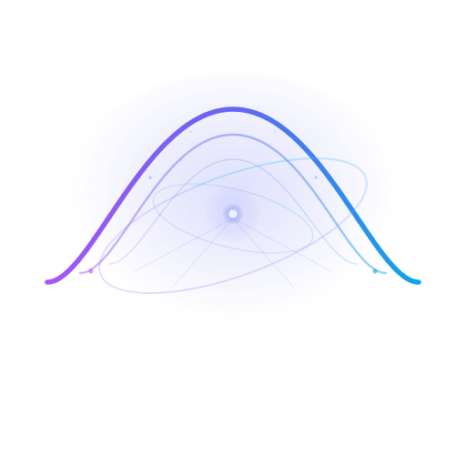

<div align="center">



# H O R I Z O N

**Your Personal Agentic AI Assistant**

<p>
A privacy-focused AI assistant with system operations, browser automation, and multi-model support.
<br />
Run locally, scale globally.
</p>

<p>
  <a href="https://nextjs.org">
    
  </a>
  <a href="https://react.dev">
    
  </a>
  <a href="https://www.typescriptlang.org">
    
  </a>
  <a href="https://tailwindcss.com">
    
  </a>
  <a href="https://ui.shadcn.com">
    
  </a>
  <br />
  <a href="https://langchain.com">
    
  </a>
  <a href="https://hono.dev">
    
  </a>
  <a href="https://www.docker.com">
    
  </a>
  <a href="https://bun.sh">
    
  </a>
</p>

<p>
  
  
  
  
  
</p>

</div>

---

## 📚 Documentation

| Guide | Description |
|-------|-------------|
| [Configuration](./docs/configuration.md) | Configuring workspace, agent settings, and deployment |
| [Development](./docs/development.md) | Setting up dev environment and contributing |
| [Deployment](./docs/deployment.md) | Docker, production, and self-hosted deployment |
| [Agent In Loop](./docs/AGENT_IN_LOOP.md) | Human-in-the-loop tool approval system |
| [Generative UI](./docs/LANGCHAIN_GENERATIVE_UI.md) | Tool call visualization with custom renderers |

---

## 🚀 About The Project

**Horizon** is an agentic AI assistant that bridges large language models with your local operating system. Unlike traditional chatbots, Horizon can execute system commands, browse the web, manage files, and run code—all through natural conversation.

### 🎯 The Problem

Most AI assistants operate in isolation, unable to interact with your actual system. They can generate text but can't execute commands, access files, or automate workflows. This creates a gap between AI capabilities and real-world tasks.

### 💡 The Solution

Horizon provides a unified interface where AI meets your operating system:

- **System Operations**: Execute terminal commands, manage files, monitor system resources
- **Browser Automation**: Search the web, extract content, summarize information
- **Code Execution**: Run code safely in sandboxed environments
- **Multi-Model Support**: Switch between OpenAI, Anthropic, Groq, Gemini, or local Ollama models

### 📍 Current State

Horizon currently features a local web UI with a LangGraph-powered TypeScript backend. It supports conversation memory, custom assistants, human-in-the-loop tool approvals, and a glassmorphic design with multiple themes.

### 🔮 Roadmap

Future releases will include scalable server architecture designed for millions of concurrent users, with production-ready deployment configurations and distributed processing capabilities.

### 💜 Inspiration

This project draws inspiration from [bolt.diy](https://github.com/stackblitz-labs/bolt.diy), a frontend coding agent with a similar architecture combining a web UI with a backend agent system.

### ✨ What Makes Horizon Unique

- **🔒 Local-First Privacy**: Run entirely on your machine with local LLM support via Ollama
- **🧠 Multi-Model Orchestration**: Seamlessly switch between cloud and local models based on task requirements
- **🎨 Glassmorphic Design**: Stunning UI with deep blurs, gradients, and modern aesthetics
- **🛠️ System Integration**: Direct access to your file system, terminal, and browser automation
- **📦 Monorepo Architecture**: Clean separation of concerns with shared packages and type safety

---

## ✨ Key Features

### 🧠 Hybrid Intelligence

- **Model Agnostic**: Support for OpenAI, Anthropic Claude, Groq, Google Gemini, and local Ollama models
- **LangGraph Orchestration**: Stateful agents that can plan, reason, and execute multi-step workflows
- **ReAct Pattern**: Advanced reasoning and acting capabilities with tool integration
- **Conversation Memory**: Persistent chat history with file-system checkpointing
- **PII Protection**: Built-in middleware for detecting and handling sensitive information

### 🖥️ User Experience

- **Glassmorphic UI**: Beautiful design with multiple stunning color themes
- **Smart Conversations**: Edit messages, explore alternative paths, attach files
- **Custom Assistants**: Create personalized AI helpers for different tasks
- **Safe Execution**: Review and approve actions before they run
- **Real-time Streaming**: Instant responses with rich markdown and code support
- **Authentication**: Secure user accounts with encrypted sessions

### 🛠️ Agent Capabilities

- **System Operations**: File management, system health monitoring (CPU/RAM), and terminal command execution
- **Browser Automation**: Web scraping, data extraction, and live information summarization
- **Code Execution**: Sandboxed environment for safe code execution
- **Multi-Language Support**: Code highlighting for JavaScript, TypeScript, Python, Rust, Go, SQL, and more

---

## 🛠️ Technology Stack

| Component            | Technologies                                                                                                                                                                                                                                                                                                                                                                                  |
| -------------------- | --------------------------------------------------------------------------------------------------------------------------------------------------------------------------------------------------------------------------------------------------------------------------------------------------------------------------------------------------------------------------------------------- |
| **Frontend**         |                 |
| **UI Components**    |                                                                                                                               |
| **State Management** |                                                                                                                                                                                                                                                                                                                    |
| **Backend**          |                                                                                                                                                                                                                 |
| **AI/ML**            |                                                                                                                                                                                                                    |
| **Database**         |                                                                                                                                                                                                                        |
| **DevOps**           |                                                                                                                                                                                                                      |

---

## 🏗️ Project Structure

```bash
horizon/
├── apps/
│   ├── web/                    # Next.js 16 React Application
│   │   ├── app/               # App Router pages
│   │   ├── components/        # React components
│   │   ├── lib/              # Utilities and stores
│   │   └── hooks/            # Custom React hooks
│   │
│   ├── backend/               # LangGraph TypeScript Agent
│   │   ├── src/
│   │   │   ├── agent/        # Agent graph and tools
│   │   │   │   ├── graph.ts  # Main LangGraph workflow
│   │   │   │   ├── tools/    # Tool implementations
│   │   │   │   └── middleware/ # PII protection
│   │   │   ├── lib/          # LLM config and utilities
│   │   │   └── index.ts      # Hono server entry
│   │   └── Dockerfile
│   │
│   └── sandbox/               # Isolated code execution environment
│
├── packages/
│   ├── ui/                    # Shared UI components (shadcn/ui)
│   ├── agent-memory/          # LangGraph memory/checkpointing
│   ├── agent-web/             # Web scraping and browser tools
│   ├── shell/                 # Shell command execution utilities
│   ├── typescript-config/     # Shared TypeScript configurations
│   └── eslint-config/         # Shared ESLint configurations
│
├── docker-compose.yaml        # Development orchestration
├── docker-compose.prod.yaml   # Production deployment
└── turbo.json                 # Turborepo configuration
```

---

## 🏁 Getting Started

### 📋 Prerequisites

- **Bun** 1.3.6+ ([Install Bun](https://bun.sh))
- **Node.js** 20+ (for compatibility)
- **Docker** & Docker Compose (recommended)
- **Git**

### 🚀 Quick Start (Docker - Recommended)

The fastest way to get Horizon running locally:

```bash
# Clone the repository
git clone https://github.com/yourusername/horizon.git
cd horizon

# Set up environment variables
cp apps/backend/.env.example apps/backend/.env
cp apps/web/.env.example apps/web/.env

# Edit the .env files with your API keys
# Required: At least one LLM provider (OpenAI, Anthropic, Groq, etc.)

# Start all services
docker-compose up --build
```

**Access Points:**

- **Web Application**: <http://localhost:3000>
- **Backend API**: <http://localhost:2024>
- **Health Check**: <http://localhost:8000/health>

### 🔧 Manual Installation (Development)

#### Backend Setup

```bash
# Navigate to backend
cd apps/backend

# Install dependencies
bun install

# Set up environment
cp .env.example .env
# Edit .env with your configuration

# Run development server
bun run dev
```

#### Frontend Setup

```bash
# Navigate to web app
cd apps/web

# Install dependencies
bun install

# Set up environment
cp .env.example .env.local
# Edit .env.local with your configuration

# Run development server
bun run dev
```

---

## ⚙️ Configuration

Horizon uses a configuration file (`config/horizon.json`) for workspace and agent settings.

### Quick Setup

```bash
# Config is auto-created on first run
# Or create manually from example:
cp config/horizon.example.json config/horizon.json
```

### Environment Variables

**Backend (`apps/backend/.env`):**

```env
# LLM Provider (at least one required)
MODEL_PROVIDER=groq
MODEL_NAME=meta-llama/llama-4-scout-17b-16e-instruct
GROQ_API_KEY=gsk_...

# Server
PORT=2024
JWT_SECRET=your-secret
```

**Frontend (`apps/web/.env.local`):**

```env
NEXT_PUBLIC_LANGGRAPH_API_URL=http://localhost:2024
```

For detailed configuration options, see [Configuration Guide](./docs/configuration.md).

---

## 🎯 Usage Guide

### 💬 Chat Interface

1. **Start a Conversation**: Navigate to `/chat` or click "New Chat"
2. **Select Model**: Choose your preferred LLM from the model selector
3. **Ask Questions**: Type naturally—Horizon understands context and can use tools
4. **Code Execution**: Request code execution for supported languages
5. **File Operations**: Ask Horizon to read, write, or analyze files

### 🔌 API Endpoints

The backend exposes a Hono-based API:

| Method | Endpoint           | Description                    |
| ------ | ------------------ | ------------------------------ |
| `POST` | `/api/chat`        | Send messages to the agent     |
| `GET`  | `/api/health`      | Health check endpoint          |
| `GET`  | `/api/models`      | List available LLM models      |
| `POST` | `/api/threads`     | Create new conversation thread |
| `GET`  | `/api/threads/:id` | Get thread history             |

---

## 🐳 Docker Deployment

### Development

```bash
# Start all services with hot reload
docker-compose up --build

# Run in background
docker-compose up -d --build

# View logs
docker-compose logs -f backend
docker-compose logs -f web

# Stop services
docker-compose down
```

### Production

```bash
# Deploy production build
docker-compose -f docker-compose.prod.yaml up -d --build
```

---

## 🧪 Development

For detailed development setup, see [Development Guide](./docs/development.md).

### Quick Reference

```bash
# Run linting
bun lint

# Format code
bun lint:fix

# Type checking
bun typecheck

# Build all packages
bun build
```

---

## ⚠️ Known Limitations

- **Browser Automation**: Requires additional setup for headless browser execution
- **Sandbox Security**: Code execution sandbox requires Docker for isolation

---

## 🤝 Contributing

Contributions are welcome! Please follow these steps:

1. **Fork** the Project
2. **Create** your Feature Branch (`git checkout -b feature/AmazingFeature`)
3. **Commit** your Changes (`git commit -m 'Add some AmazingFeature'`)
4. **Push** to the Branch (`git push origin feature/AmazingFeature`)
5. **Open** a Pull Request

Please ensure your code:

- Passes all linting checks (`bun run lint`)
- Includes TypeScript types
- Follows the existing code style
- Includes tests for new features

---

## 📜 License

Distributed under the MIT License. See `LICENSE` for more information.

---

<div align="center">
<br />

**👤 Author**

Mohana Krishna

<p>
  <a href="mailto:codexmohan@gmail.com">
    
  </a>
  <a href="https://github.com/codex-mohan">
    
  </a>
  <a href="https://linkedin.com/in/codex-mohan">
    
  </a>
</p>

<br />

<p><i>"Past the Event Horizon, everything is possible."</i></p>

<p>
  <sub>Built with 💜 using Next.js, LangGraph, and lots of caffeine</sub>
</p>

<p>
  If you found this project helpful, please consider giving it a ⭐
</p>

</div>
